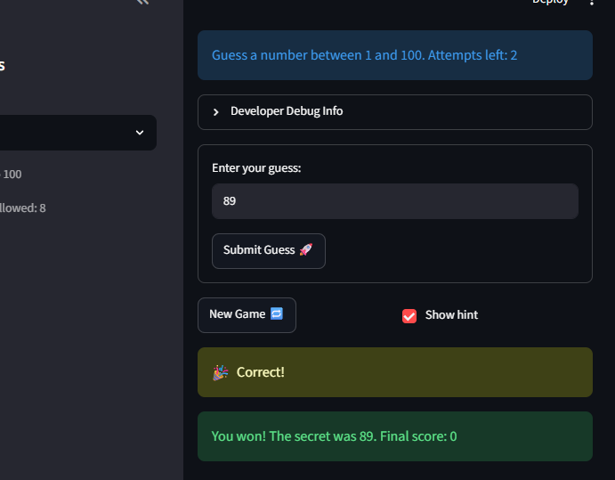

# 🎮 Game Glitch Investigator: The Impossible Guesser

## 🚨 The Situation

You asked an AI to build a simple "Number Guessing Game" using Streamlit.
It wrote the code, ran away, and now the game is unplayable. 

- You can't win.
- The hints lie to you.
- The secret number seems to have commitment issues.

## 🛠️ Setup

1. Install dependencies: `pip install -r requirements.txt`
2. Run the broken app: `python -m streamlit run app.py`

## 🕵️‍♂️ Your Mission

1. **Play the game.** Open the "Developer Debug Info" tab in the app to see the secret number. Try to win.
2. **Find the State Bug.** Why does the secret number change every time you click "Submit"? Ask ChatGPT: *"How do I keep a variable from resetting in Streamlit when I click a button?"*
3. **Fix the Logic.** The hints ("Higher/Lower") are wrong. Fix them.
4. **Refactor & Test.** - Move the logic into `logic_utils.py`.
   - Run `pytest` in your terminal.
   - Keep fixing until all tests pass!

## 📝 Document Your Experience

- [x] Describe the game's purpose.
- [x] Detail which bugs you found.
- [x] Explain what fixes you applied.

The game's purpose is to engage the audience into guessing the right number by providing sets of hints to guide them to the right answer.I found bugs like the hints not working properly, to the point if the user guessed the secret number it would give the wrong hint like go LOWER. I also found that the enter button did not work when I would input a guess. I separated the logic by making check_guess strictly determine the result and creating get_hint to handle the right message.I wrapped the guess input and the Submit button together in a st.form. Inside a form, pressing Enter now triggers the submit button.

While debugging I also fixed three more glitches: the score could go *up* on a wrong "Too High" guess, so now every wrong guess consistently loses 5 points; the prompt was hardcoded to "between 1 and 100" even on Easy/Hard, so it now shows the real difficulty range; and "New Game" used to ignore the difficulty range and keep the old score/history, so it now picks the secret within the correct range and fully resets the score, status, and history.
## 📸 Demo Walkthrough

Describe your fixed game in numbered steps so a reader can follow along without watching a video:

1. <!-- Describe this step --> User enters 70
2. <!-- Describe this step --> The game tells user to go higher
3. <!-- Describe this step -->User enters 90
4. <!-- Describe this step --> The game tells user to go lower
5. <!-- Add more steps as needed --> User guesses 89 
6. The game prints out "Correct".

**Screenshot** *(optional)*: <!-- Insert a screenshot of your fixed, winning game here -->


## 🧪 Test Results

```
$ python -m pytest tests/
============================= test session starts =============================
platform win32 -- Python 3.13.14, pytest-9.1.1, pluggy-1.6.0
collected 6 items

tests\test_game_logic.py ......                                          [100%]

============================== 6 passed in 0.12s ==============================
```

## 🚀 Stretch Features

- [ ] [If you choose to complete Challenge 4, describe the Enhanced UI changes here — a screenshot is optional]
